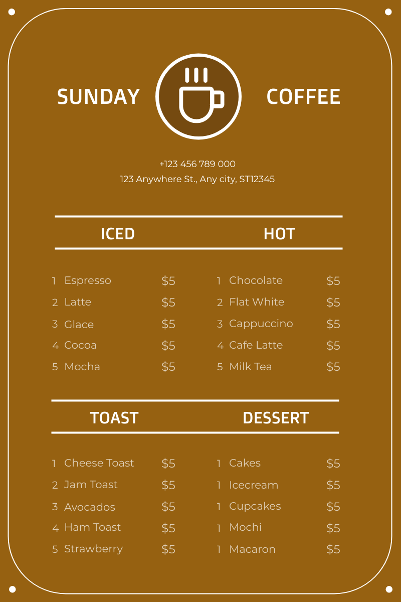
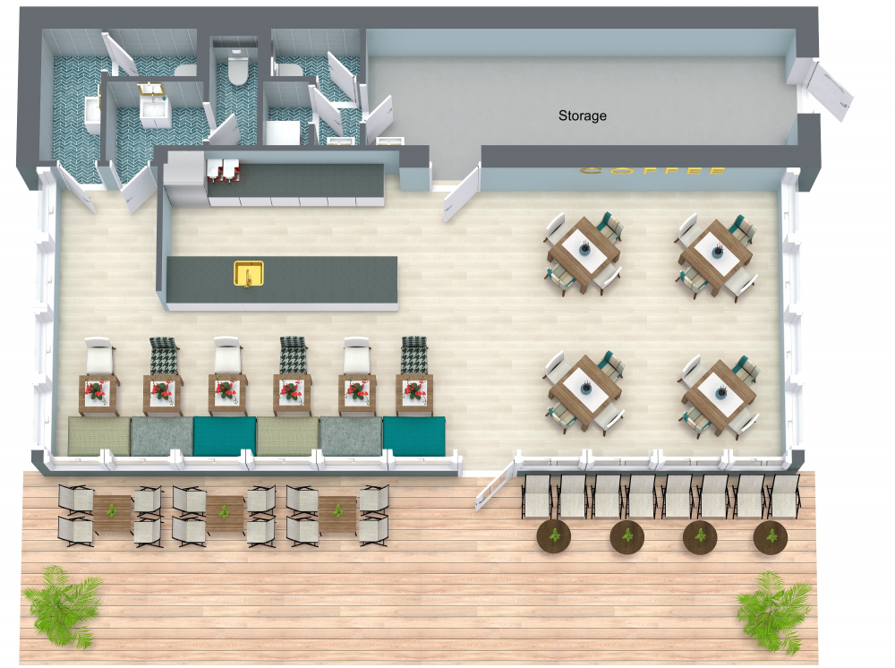
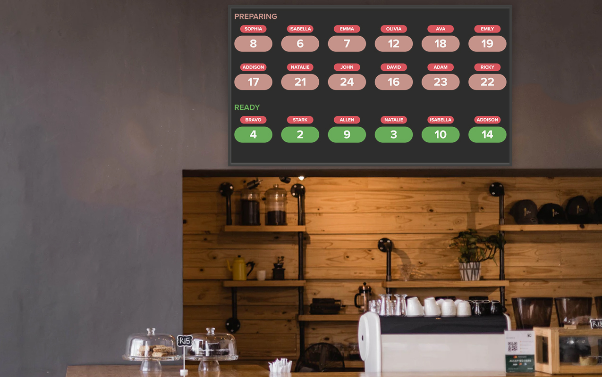

# Cozy Cup Cafe

### Project Description
Cozy Cup Cafe is a beautiful cafe where visitors may browse and purchase their favorite beverages in a relaxing and lovely way.

### Features
- Browse a selection of numerous hot and cold beverages.
- Users can modify orders using an easy-to-use interface.
- Providing a comfortable virtual sitting cafe area feels.
- The order status is updated in real time.

### Screen Captures

*Users can explore this lovely menu.*

*Users can choose what cup they prefer with a customization of their order.*

*Enjoying a cozy cafe atmosphere* 

*The real-time status of an order placed at Cozy Cup Cafe.*

### About the Authors

**Name:** Nathalie Shane Abia

**Email:** abianathalie30@gmail.com

 

